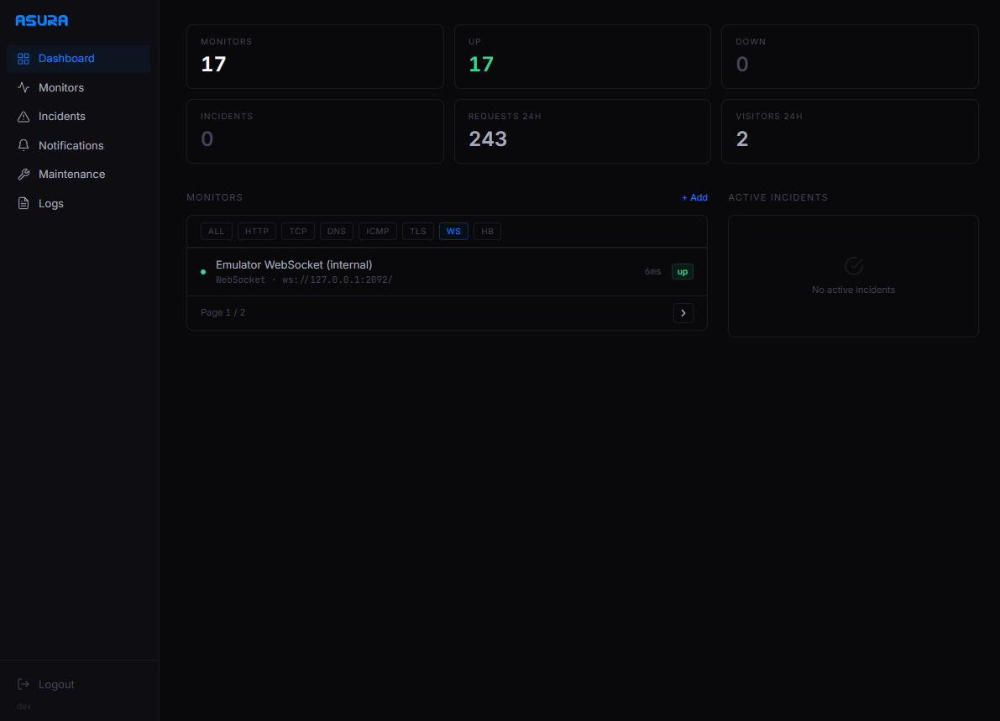

<p align="center">
  <h1 align="center">
    
  </h1>
  <p align="center">A self-contained Go monitoring service with no external runtime dependencies.</p>
  <p align="center">
    <a href="https://github.com/y0f/Asura/actions/workflows/ci.yml"></a>
    <a href="https://goreportcard.com/report/github.com/y0f/Asura?branch=main"></a>
    <a href="https://github.com/y0f/Asura/blob/main/go.mod"></a>
    <a href="LICENSE"></a>
    <a href="https://github.com/y0f/Asura/releases/latest"></a>
    <a href="https://github.com/y0f/Asura/pkgs/container/asura"></a>
  </p>
  <p align="center">
    <a href="#quick-start">Quick Start</a> &middot;
    <a href="#production-deployment">Production Deployment</a> &middot;
    <a href="#api">API Docs</a> &middot;
    <a href="#configuration">Configuration</a> &middot;
    <a href="CONTRIBUTING.md">Contributing</a>
  </p>
</p>

---

Asura monitors your infrastructure from a single Go binary backed by SQLite. No Postgres. No Redis. No Node.js. Just `scp` a binary and go.

```bash
git clone https://github.com/y0f/Asura.git && cd Asura && sudo bash install.sh
```

### Why Asura?

| | Asura | Typical alternative |
|---|---|---|
| **Runtime** | Single static binary | Node.js / Java / Python runtime |
| **Database** | SQLite compiled in | Requires Postgres, MySQL, or Redis |
| **Binary size** | ~15 MB | 100-500 MB installed |
| **Concurrency** | Goroutine worker pool with channel backpressure and adaptive scheduling | Event loop or thread pool |
| **Deploy** | `scp` binary + run | Package manager, runtime install, migrations |
| **Config** | One YAML file | Multiple config files, env vars, database setup |
| **RAM** | ~20 MB idle | Varies — runtime + database overhead |

No runtime. No external database. No container required. Build, copy, run.

### Highlights

| Feature | |
|---|---|
| **9 protocols** | HTTP, TCP, DNS, ICMP, TLS, WebSocket, Command, Docker, Heartbeat |
| **Assertion engine** | 9 types -- status code, body text, body regex, JSON path, headers, response time, cert expiry, DNS records |
| **Change detection** | Line-level diffs on response bodies |
| **Incidents** | Automatic creation, thresholds, ack, recovery |
| **Notifications** | Webhook (HMAC-SHA256), Email, Telegram, Discord, Slack, ntfy |
| **Monitor groups** | Organize monitors into named groups with custom sort order |
| **Per-monitor routing** | Route notifications to specific channels per monitor |
| **Maintenance** | Recurring windows to suppress alerts |
| **Heartbeat monitoring** | Cron jobs, workers, and pipelines report in -- silence triggers incidents |
| **Web dashboard** | Form-based monitor & notification config, assertion builder, dark/light mode |
| **Request logging** | Built-in request log viewer with visitor analytics and per-monitor tracking |
| **Multiple status pages** | Create multiple public status pages, each with its own slug, monitors, and grouping |
| **Analytics** | Uptime %, response time percentiles |
| **Prometheus** | `/metrics` endpoint, ready to scrape |
| **Sub-path support** | Serve from `/asura` or any prefix behind a reverse proxy |
| **Trusted proxies** | Correct client IP detection behind nginx/caddy |
| **SQLite + WAL** | Concurrent reads, single writer, zero config |
| **~15 MB** | Cross-compiles to `linux/amd64` and `linux/arm64` |

---

## Web UI

Built with HTMX, Tailwind, and Alpine.js.



### Features

- **Form-based monitor configuration** — per-protocol settings with dropdowns, toggles, and key-value builders. No JSON required.
- **Assertion builder** — visual rule editor with type-aware operator dropdowns and soft/hard failure modes.
- **Notification channel forms** — per-type fields for Webhook, Email, Telegram, Discord, Slack, and ntfy. Event checkboxes instead of CSV.
- **Advanced JSON mode** — toggle on any form to drop into a raw JSON textarea for power users or API parity.
- **Monitor groups** — organize monitors into named groups with drag-to-reorder sorting.
- **Dashboard** — live status overview with response time sparklines, tag filters, and bulk actions.
- **Incident timeline** — per-incident event history with ack/resolve actions.
- **Content change diffs** — line-level diffs on response bodies.
- **Request log viewer** — filter by route group, method, status code with visitor analytics.
- **Multiple status pages** — create multiple public status pages with per-page monitor selection, grouping, and custom CSS.
- **Sub-path aware** — all links, forms, and assets respect `base_path` configuration.

The UI is enabled by default and can be disabled for API-only deployments:

```yaml
server:
  web_ui_enabled: true
```

---

## Quick Start

### VPS (recommended)

```bash
git clone https://github.com/y0f/Asura.git
cd Asura
sudo bash install.sh
```

Installs Go (if needed), builds the binary, creates a systemd service and generates an admin key. Under 2 minutes on a fresh Ubuntu box.

**Important:** By default, Asura binds to `127.0.0.1:8090` and is **not** accessible from the internet. You must set up a reverse proxy to expose it. See [Production Deployment](#production-deployment) below.

```bash
systemctl status asura
curl http://127.0.0.1:8090/api/v1/health
```

### Docker Compose

```bash
git clone https://github.com/y0f/Asura.git
cd Asura
cp config.example.yaml config.yaml
# set your API key hash and database.path to /app/data/asura.db
docker compose up -d
```

### From source

```bash
make build
./asura --setup                        # generates key + hash
cp config.example.yaml config.yaml     # paste the hash
./asura -config config.yaml
```

### Cross-compile + deploy

```bash
make release
scp dist/asura-linux-amd64 you@server:/usr/local/bin/asura
```

---

## Production Deployment

Asura listens on localhost, nginx terminates TLS and proxies to it — never exposed directly to the internet.

### 1. Install Asura

```bash
git clone https://github.com/y0f/Asura.git
cd Asura
sudo bash install.sh
```

Save the admin API key printed at the end. It cannot be recovered.

### 2. Configure

Edit `/etc/asura/config.yaml`:

```yaml
server:
  # Bind to localhost only — never bind to 0.0.0.0 on a public server
  listen: "127.0.0.1:8090"

  # Serve all routes under /asura (optional, remove for root)
  base_path: "/asura"

  # Your public URL — used in notification links
  external_url: "https://example.com/asura"

  # Trust nginx's forwarded headers for real client IP
  trusted_proxies:
    - "127.0.0.1"
    - "::1"

auth:
  session:
    cookie_secure: true    # Requires HTTPS (which nginx provides)
```

### 3. Set up nginx reverse proxy

Copy the example config and replace `example.com` with your domain:

```bash
sudo cp deploy/nginx.conf /etc/nginx/sites-available/asura
sudo sed -i 's/example.com/yourdomain.com/g' /etc/nginx/sites-available/asura
sudo ln -s /etc/nginx/sites-available/asura /etc/nginx/sites-enabled/
sudo nginx -t && sudo systemctl reload nginx
```

The example config ([`deploy/nginx.conf`](deploy/nginx.conf)) includes both a sub-path variant (`example.com/asura/`) and a commented-out root variant (`monitor.example.com/`).

### 4. Verify

```bash
# Local health check (bypasses nginx)
curl http://127.0.0.1:8090/asura/api/v1/health

# Public health check (through nginx + TLS)
curl https://example.com/asura/api/v1/health

# Web UI
# Open https://example.com/asura/ in your browser
```

### Alternative: Caddy

Caddy handles TLS automatically:

```
example.com {
    redir /asura /asura/ permanent
    reverse_proxy /asura/* 127.0.0.1:8090
}
```

### Serving from Root (no base_path)

If you want Asura at `https://monitor.example.com/` instead of a sub-path, omit `base_path` and uncomment the root variant in [`deploy/nginx.conf`](deploy/nginx.conf).

---

## Manual Setup

```bash
# Build
make build
sudo install -m 755 asura /usr/local/bin/asura

# Generate API key
asura --setup

# System user + directories
sudo useradd --system --no-create-home --shell /usr/sbin/nologin asura
sudo mkdir -p /etc/asura /var/lib/asura
sudo chown asura:asura /var/lib/asura
sudo chmod 700 /var/lib/asura

# Config
sudo cp config.example.yaml /etc/asura/config.yaml
# set hash, database.path, base_path, trusted_proxies
sudo chmod 640 /etc/asura/config.yaml
sudo chown root:asura /etc/asura/config.yaml

# Systemd
sudo cp asura.service /etc/systemd/system/
sudo systemctl daemon-reload
sudo systemctl enable --now asura
```

---

## Configuration

See [`config.example.yaml`](config.example.yaml) for all options. Environment variables expand via `${VAR_NAME}`.

| Section    | Controls                                              |
|------------|-------------------------------------------------------|
| `server`   | Listen address, TLS, timeouts, CORS, rate limiting, base path, external URL, trusted proxies, web UI toggle, frame embedding |
| `database` | SQLite path, read pool size, retention policy, request log retention |
| `auth`     | API keys (SHA-256 hashed), roles, session lifetime, login rate limiting |
| `monitor`  | Worker count, default intervals, thresholds, adaptive scheduling |
| `logging`  | Level (debug/info/warn/error), format (text/json)     |

### Key Server Settings

| Setting | Default | Description |
|---------|---------|-------------|
| `listen` | `127.0.0.1:8090` | Address to bind. Use `127.0.0.1:PORT` in production |
| `base_path` | `""` | URL prefix for all routes (e.g. `/asura`) |
| `external_url` | auto | Public URL for notification links |
| `trusted_proxies` | `[]` | IPs/CIDRs whose `X-Real-IP`/`X-Forwarded-For` headers are trusted |
| `rate_limit_per_sec` | `10` | Per-IP request rate limit |
| `web_ui_enabled` | `true` | Set `false` for API-only mode |

### Key Monitor Settings

| Setting | Default | Description |
|---------|---------|-------------|
| `workers` | `10` | Concurrent check workers |
| `default_interval` | `60s` | Default check interval for new monitors |
| `default_timeout` | `10s` | Default check timeout |
| `adaptive_intervals` | `true` | Dynamically adjust check frequency based on monitor stability |

#### Adaptive Intervals

When enabled, the scheduler adjusts the effective check interval per monitor based on its recent behavior:

- **Stable monitors** (60+ consecutive successes) gradually slow down to 2x their base interval, reducing unnecessary checks
- **Flapping monitors** (failure after being slowed down) snap back to 0.5x the base interval for faster detection
- **Recovering monitors** return to the normal base interval until stability is confirmed
- **Actively failing monitors** stay at the normal base interval

The base interval configured per monitor is never modified — adaptive intervals only adjust the scheduler's internal timing. Disable with `adaptive_intervals: false` to always use fixed intervals.

---

## Authentication

Asura uses API keys authenticated via SHA-256 hashes. Keys are configured in `config.yaml` -- there is no user registration or database-stored auth.

### Generating a Key (Recommended)

Use the built-in generator:

```bash
./asura --setup
```

Output:

```
  API Key : ak_a8f3e7b2c1d9...
  Hash    : fa223e3e1c4b96...

  Put the hash in config.yaml under auth.api_keys[].hash
  Save the API key -- it cannot be recovered.
```

The `ak_` prefix makes keys identifiable in logs and config without exposing the secret.

### Hashing an Existing Key

If you prefer to choose your own key:

```bash
./asura --hash-key "your-secret-key"
# Output: 2c26b46b68ffc68ff99b453c1d30413413422d706483bfa0f98a5e886266e7ae
```

### Config

```yaml
auth:
  api_keys:
    - name: "admin"
      hash: "2c26b46b68ffc..."
      role: "admin"
```

### Roles

| Role | Access |
|------|--------|
| `admin` | Full read/write access to all resources |
| `readonly` | Read-only access (monitors, incidents, notifications, maintenance, metrics) |

### Custom Permissions

Instead of a role, you can grant specific permissions:

```yaml
auth:
  api_keys:
    - name: "ci-bot"
      hash: "..."
      permissions:
        - "monitors.read"
        - "monitors.write"
        - "incidents.read"
```

Available permissions: `monitors.read`, `monitors.write`, `incidents.read`, `incidents.write`, `notifications.read`, `notifications.write`, `maintenance.read`, `maintenance.write`, `metrics.read`.

### Using Your Key

**API**: Pass the raw key (not the hash) in the `X-API-Key` header:

```bash
curl -H "X-API-Key: ak_a8f3e7b2c1d9..." https://example.com/asura/api/v1/monitors
```

**Web UI**: Enter the key on the login page. A session cookie is created (24h, HttpOnly, Secure). Login attempts are rate-limited per IP. Multiple keys with different roles are supported — key names appear in the audit log.

---

## API

All endpoints return JSON. Authenticate with `X-API-Key` header. When `base_path` is configured, all paths are prefixed (e.g. `/asura/api/v1/health`).

### Health *(no auth)*

```
GET  /api/v1/health       Status, uptime
```

### Metrics *(read auth)*

```
GET  /metrics             Prometheus exposition format
```

### Monitors

```
GET    /api/v1/monitors                List
POST   /api/v1/monitors                Create
GET    /api/v1/monitors/{id}           Get
PUT    /api/v1/monitors/{id}           Update
DELETE /api/v1/monitors/{id}           Delete
POST   /api/v1/monitors/{id}/pause     Pause
POST   /api/v1/monitors/{id}/resume    Resume
GET    /api/v1/monitors/{id}/checks    Check history
GET    /api/v1/monitors/{id}/metrics   Analytics
GET    /api/v1/monitors/{id}/changes   Content changes
GET    /api/v1/monitors/{id}/chart     Response time chart data
```

| Field              | Type     | Required | Description                                        |
|--------------------|----------|----------|----------------------------------------------------|
| `name`             | string   | yes      | Display name                                       |
| `description`      | string   |          | Optional description or notes                      |
| `type`             | string   | yes      | `http` `tcp` `dns` `icmp` `tls` `websocket` `command` `docker` `heartbeat` |
| `target`           | string   | yes      | URL, host:port, domain, or command                 |
| `interval`         | int      |          | Seconds between checks (default: 60)               |
| `timeout`          | int      |          | Timeout in seconds (default: 10)                   |
| `tags`             | string[] |          | Grouping tags                                      |
| `group_id`         | int      |          | Monitor group ID (null if ungrouped)               |
| `notification_channel_ids` | int[] |   | Notification channels to route to (empty = all)    |
| `settings`         | object   |          | Protocol-specific ([see below](#protocol-settings)) |
| `assertions`       | array    |          | Assertion rules ([see below](#assertions))          |
| `track_changes`    | bool     |          | Enable content change detection                    |
| `failure_threshold`| int      |          | Failures before incident (default: 3)              |
| `success_threshold`| int      |          | Successes before recovery (default: 1)             |
| `upside_down`      | bool     |          | Inverted mode — "up" becomes "down" and vice versa |
| `resend_interval`  | int      |          | Re-send notifications every N checks while down (0 = once) |

### Heartbeat Monitoring

Create a heartbeat monitor to track cron jobs, workers, or pipelines. If they stop pinging, Asura fires an incident.

```bash
# Create heartbeat monitor
curl -X POST https://example.com/asura/api/v1/monitors \
  -H "X-API-Key: $KEY" \
  -H "Content-Type: application/json" \
  -d '{"name":"Nightly Backup","type":"heartbeat","interval":3600,"settings":{"grace":300}}'
```

Response includes the ping token:

```json
{
  "monitor": { "id": 1, "name": "Nightly Backup", "type": "heartbeat", ... },
  "heartbeat": { "token": "a1b2c3d4e5f6...", "grace": 300, "status": "pending" }
}
```

Ping from your script (no auth needed):

```bash
curl -X POST https://example.com/asura/api/v1/heartbeat/a1b2c3d4e5f6...
```

If no ping arrives within `interval + grace` seconds, the monitor goes down and an incident is created.

### Status Pages

```
GET    /api/v1/status-pages       List all status pages
GET    /api/v1/status-pages/{id}  Get status page with assigned monitors
POST   /api/v1/status-pages       Create a new status page
PUT    /api/v1/status-pages/{id}  Update a status page
DELETE /api/v1/status-pages/{id}  Delete a status page
```

Each status page has its own `slug` (URL path), `title`, `description`, and monitor set. Monitors are assigned per-page with optional `sort_order` and `group_name` for display grouping. The page is served at `/{slug}`.

The public API for a specific page is available at `GET /api/v1/status-pages/{id}/public` (no auth required). Returns public fields only (name, status, uptime).

### Status Badges *(monitors on enabled status pages)*

```
GET  /api/v1/badge/{id}/status     Status badge (up/down/degraded)
GET  /api/v1/badge/{id}/uptime     30-day uptime percentage
GET  /api/v1/badge/{id}/response   24h median response time
```

Badges are available for any monitor assigned to an enabled status page. Embed in a README:

```markdown


```

### Monitor Groups

```
GET    /api/v1/groups                  List
POST   /api/v1/groups                  Create
PUT    /api/v1/groups/{id}             Update
DELETE /api/v1/groups/{id}             Delete
```

| Field        | Type   | Required | Description                    |
|--------------|--------|----------|--------------------------------|
| `name`       | string | yes      | Group name (max 255 chars)     |
| `sort_order` | int    |          | Display order (default: 0)     |

Assign monitors to a group by setting `group_id` on the monitor. Deleting a group ungroups its monitors (sets `group_id` to null).

### Incidents

```
GET    /api/v1/incidents               List (filter: monitor_id, status)
GET    /api/v1/incidents/{id}          Get with timeline
POST   /api/v1/incidents/{id}/ack      Acknowledge
POST   /api/v1/incidents/{id}/resolve  Resolve
DELETE /api/v1/incidents/{id}          Delete
```

### Notifications

```
GET    /api/v1/notifications           List
POST   /api/v1/notifications           Create
PUT    /api/v1/notifications/{id}      Update
DELETE /api/v1/notifications/{id}      Delete
POST   /api/v1/notifications/{id}/test Test
```

Types: `webhook` `email` `telegram` `discord` `slack` `ntfy`

Events: `incident.created` `incident.acknowledged` `incident.resolved` `content.changed`

<details><summary><strong>Notification Settings by Type</strong></summary>

**Webhook**
```json
{"url": "https://example.com/hook", "secret": "hmac-secret"}
```

**Telegram**
```json
{"bot_token": "123456:ABC-DEF...", "chat_id": "-1001234567890"}
```

**Discord**
```json
{"webhook_url": "https://discord.com/api/webhooks/..."}
```

**Slack**
```json
{"webhook_url": "https://hooks.slack.com/services/...", "channel": "#alerts"}
```

**Email (SMTP)**
```json
{"host": "smtp.example.com", "port": 587, "username": "alerts@example.com", "password": "...", "from": "alerts@example.com", "to": ["ops@example.com", "oncall@example.com"]}
```

**ntfy**
```json
{"topic": "my-alerts", "server_url": "https://ntfy.sh", "priority": 4, "tags": "warning"}
```
`server_url` defaults to `https://ntfy.sh` if omitted. `priority` (1-5), `tags`, and `click_url` are optional.
</details>

### Maintenance Windows

```
GET    /api/v1/maintenance             List
POST   /api/v1/maintenance             Create
PUT    /api/v1/maintenance/{id}        Update
DELETE /api/v1/maintenance/{id}        Delete
```

`recurring` values: `""` (one-time), `"daily"`, `"weekly"`, `"monthly"`

### Request Logs

```
GET    /api/v1/request-logs            List (filter: group, method, status_code, range)
GET    /api/v1/request-logs/stats      Aggregate stats (requests, visitors, latency)
```

### Other

```
GET    /api/v1/overview                Status summary
GET    /api/v1/tags                    All tags
```

Pagination: `?page=1&per_page=20` on all list endpoints.

---

## Assertions

Evaluated after each check. Failed assertions mark a monitor `down` or `degraded`.

| Type            | Description                 | Operators                          |
|-----------------|-----------------------------|------------------------------------|
| `status_code`   | HTTP status code            | eq, neq, gt, lt, gte, lte         |
| `body_contains` | Body text search            | contains, not_contains             |
| `body_regex`    | Body regex match            | matches, not_matches               |
| `json_path`     | JSON value at dot-path      | eq, neq, gt, lt, contains, exists |
| `header`        | Response header value       | eq, neq, contains, exists         |
| `response_time` | Response time (ms)          | lt, lte, gt, gte                  |
| `cert_expiry`   | Days until cert expires     | gt, gte, lt, lte                  |
| `dns_record`    | DNS record value            | contains, eq                       |

```json
{
  "assertions": [
    {"type": "status_code", "operator": "eq", "value": "200"},
    {"type": "response_time", "operator": "lt", "value": "2000"},
    {"type": "json_path", "target": "status", "operator": "eq", "value": "ok"},
    {"type": "response_time", "operator": "lt", "value": "5000", "degraded": true}
  ]
}
```

---

## Protocol Settings

<details><summary><strong>HTTP</strong></summary>

| Field              | Type              | Description                                                |
|--------------------|-------------------|------------------------------------------------------------|
| `method`           | string            | HTTP method (default: `GET`)                               |
| `headers`          | map[string]string | Custom request headers                                     |
| `body`             | string            | Request body (for POST/PUT/PATCH)                          |
| `body_encoding`    | string            | Content-Type hint: `json`, `xml`, `form`, or empty for raw |
| `auth_method`      | string            | `none`, `basic`, or `bearer` (default: inferred)           |
| `basic_auth_user`  | string            | Basic auth username                                        |
| `basic_auth_pass`  | string            | Basic auth password                                        |
| `bearer_token`     | string            | Bearer token (used when `auth_method` is `bearer`)         |
| `expected_status`  | int               | Expected HTTP status code (0 = any 2xx/3xx)                |
| `follow_redirects` | bool              | Follow redirects (default: true) — legacy, prefer `max_redirects` |
| `max_redirects`    | int               | Maximum redirect hops (0 = don't follow, default: 10)      |
| `skip_tls_verify`  | bool              | Skip TLS certificate verification                          |
| `cache_buster`     | bool              | Append unique query param to bypass caches                 |

```json
{
  "method": "POST",
  "headers": {"X-Custom": "value"},
  "body": "{\"key\":\"value\"}",
  "body_encoding": "json",
  "auth_method": "bearer",
  "bearer_token": "eyJhbGci...",
  "expected_status": 200,
  "max_redirects": 5,
  "skip_tls_verify": false,
  "cache_buster": false
}
```
</details>

<details><summary><strong>TCP</strong></summary>

```json
{"send_data":"PING\r\n","expect_data":"PONG"}
```
</details>

<details><summary><strong>DNS</strong></summary>

```json
{"record_type":"A","server":"8.8.8.8"}
```
</details>

<details><summary><strong>TLS</strong></summary>

```json
{"warn_days_before":30}
```
</details>

<details><summary><strong>WebSocket</strong></summary>

```json
{"headers":{"Authorization":"Bearer token"},"send_message":"ping","expect_reply":"pong"}
```
</details>

<details><summary><strong>Command</strong></summary>

```json
{"command":"/usr/local/bin/check_health","args":["--host","db.local"]}
```
</details>

<details><summary><strong>Docker</strong></summary>

| Field              | Type   | Description                                              |
|--------------------|--------|----------------------------------------------------------|
| `container_name`   | string | Container name or ID (overrides target if set)           |
| `socket_path`      | string | Docker socket path (default: `/var/run/docker.sock`)     |
| `check_health`     | bool   | Use container health status instead of just running state |

```json
{"container_name":"nginx","socket_path":"/var/run/docker.sock","check_health":true}
```

Status mapping:
- **up**: container running (or healthy when `check_health` is enabled)
- **degraded**: container running, health status is `starting`
- **down**: container stopped/exited, not found, or unhealthy

**Setup — systemd (native install):**

```bash
sudo usermod -aG docker asura
sudo systemctl restart asura
```

**Setup — Docker:** Mount the host socket into the container:

```yaml
volumes:
  - /var/run/docker.sock:/var/run/docker.sock
```
</details>

---

## Webhook Signing

Webhook notifications include an `X-Asura-Signature` header: `sha256=<hex HMAC-SHA256 of body>`.

## Architecture

```
Scheduler -> Worker Pool -> Result Processor -> Dispatcher
    |            |               |                  |
 Min-heap    Concurrent      Incidents +      Webhook/Email/Telegram
 dispatch     Checks        Change Diffs      Discord/Slack/ntfy
```

Min-heap scheduler dispatches only due monitors each tick (O(log n) per dispatch). Channel-based pipeline with backpressure. SQLite WAL mode with separate read/write pools.

## Contributing

See [CONTRIBUTING.md](CONTRIBUTING.md).

## Security

See [SECURITY.md](SECURITY.md).

## License

[MIT](LICENSE)
